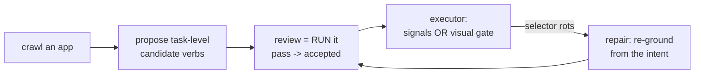

# verbivore

Vision-assisted verbs for browser testing: crawl a site, digest it into verbs.

Hand-written test verbs work (see [the approach this grew out of](https://hotchkiss.io/blog/instrumenting-playwright-the-gift-that-keeps-giving)) but carry two costs that never go away: selectors rot, and "did that click actually DO anything?" needs hand-built settle logic that fails silently when it's wrong. Verbivore aims small local vision models at exactly those two seams — trained on data the DOM labels for free — and keeps everything else deterministic. Pure Rust: [chromiumoxide](https://github.com/mattsse/chromiumoxide) drives the browser, [burn](https://github.com/tracel-ai/burn) trains and serves the models on the SAME code (no export boundary to debug).

[SPEC.md](SPEC.md) owns the what and why; [PLAN.md](PLAN.md) + [PLAN_ARCHIVE.md](PLAN_ARCHIVE.md) are the build log with every measured result inline. Status: the full loop below works end to end on local corpus apps; nothing on crates.io yet.

## The loop



A verb is DATA, one json file per record — "submit login": type the fields, click submit, container-scoped intents, provenance ([format doc](docs/verb-format.md)) — never generated code. The executor runs records through four primitives plus a custom-action escape hatch; every failure is a typed breakage, and the repair loop re-grounds a rotted selector from the step's intent against the live page, then sends the patched record back through review. Acceptance is execution: a candidate that can't run never becomes a verb.

After every action the executor asks "did anything actually happen?" — DOM/network signals catch effects that paint nothing, a trained pair model catches effects that signal nothing (canvas redraws). A click on dead pixels doesn't throw, it quietly produces a wrong dataset three steps later; here it fails the run with the before/after screenshots in a diagnostic bundle.

## What's measured (2026-07-23)

- Effect model (diff-stack CNN, ~2M params): 1.000 catch / 0.014 false-alarm on held-out pages at a threshold frozen on TRAIN — and the tuned-SSIM baseline it had to beat cannot pass the spec gates at ANY threshold on the same corpus (subtle real changes score below its ambient-noise floor). Sabotage harness: 15/15 rewired clicks detected.
- Intent grounding (token ranking over the accessibility tree): 0.944 top-1 on a held-out app.
- Vision detector (CenterNet-style, from scratch): cross-app mAP 0.026 ± 0.026 — weak, and the measured lever is corpus diversity, not architecture or epochs (both replicated flat). It is NOT in the runtime path today; its job is canvas content, where there is no tree to rank over.

The corpus is auto-labeled — bounding boxes and roles from the accessibility tree, effect labels from mutation/network signals with per-node ambient suppression. No human ever drew a box. The two labeler bugs that corrupted training labels along the way (and the model faithfully LEARNING the corruption, twice) were the best ML lessons in the repo — the archive has the full postmortems.

## Try it

```sh
cd corpus && docker compose up -d && ./seed.sh   # disposable local apps
cargo build --release

# crawl an app into candidates, review one by running it, execute it
target/release/verbivore crawl --verbs verbs http://localhost:42002/
target/release/verbivore list-verbs --verbs verbs --app localhost-42002
target/release/verbivore accept-verb --verbs verbs --app localhost-42002 --id open-explore
target/release/verbivore run-verb --verbs verbs --app localhost-42002 --id open-explore

# or ground a single intent phrase straight to a reviewed verb
target/release/verbivore generate-verb --verbs verbs --url http://localhost:42002/ --accept "the explore link"
```

Only point the crawler and harvester at apps you own or have permission to exercise — they click things.

## Layout

- `crates/verbivore-verb` — the record format ([docs/verb-format.md](docs/verb-format.md)); no browser dep, no ML dep — records outlive both
- `crates/verbivore-dataset` — on-disk datasets (screenshots + labels, before/after pairs), intent ranking, snapping geometry; browser-free so training never links chromiumoxide
- `crates/verbivore-harvester` — drives Chrome: rendering variations, a11y labeling, effect-pair capture
- `crates/verbivore-grounding` — the vision detector (training, decode, eval)
- `crates/verbivore-effect` — the effect pair model, its SSIM baseline and the runtime gate
- `crates/verbivore-executor` — runs records: typed breakage, accept flow, repair loop
- `crates/verbivore-generator` — the crawler and the intent-phrase entrance
- `crates/verbivore` — the CLI
- `corpus/` — dockerized apps to harvest: `cd corpus && docker compose up -d && ./seed.sh`

## Tests

`cargo test` needs a system Chrome install (it launches headless). Corpus-dependent tests are ignore-gated: bring the corpus up, then `cargo test -- --ignored`.

## License

MIT OR Apache-2.0.
