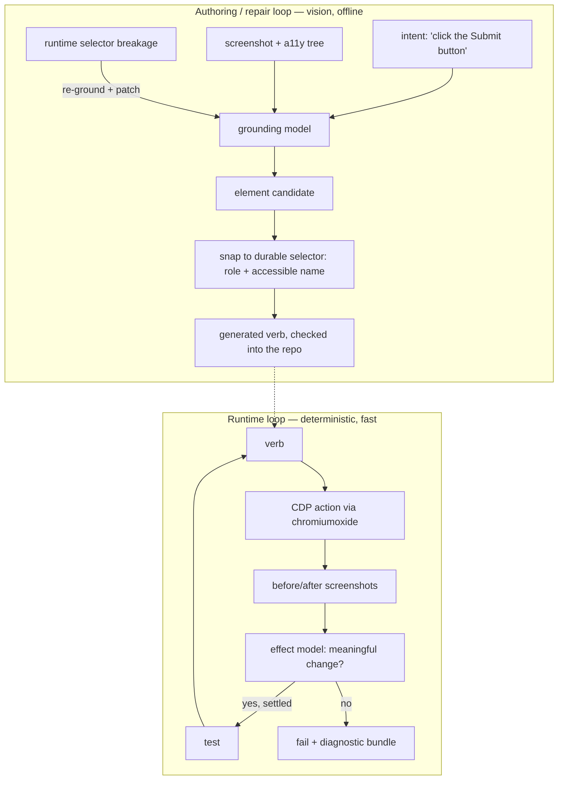

# SPEC — verbivore

Vision-assisted verbs for browser testing. The name is the pitch: a verbivore devours a site and digests it into verbs (and yes, it follows the herbivore/carnivore pattern on purpose).

## Intent

Build the next generation of the [verb approach to browser testing](https://hotchkiss.io/blog/instrumenting-playwright-the-gift-that-keeps-giving), replacing its two worst fragilities with small LOCAL vision models: finding elements (selectors rot) and confirming an action actually did something (settle logic was the single buggiest part of the recon-gen driver — disk-cache misses, stale refreshes, race conditions, every one hand-patched).

To be clear, this project has TWO goals and the second is not incidental:

1. A working tool: verbs that are generated instead of hand-created, and that verify their own effects visually.
2. ML experience end-to-end, in pure Rust: dataset construction, training, eval and local inference — NOT wiring an off-the-shelf VLM to an API (that's integration experience, a different thing).

## The problem

The verb layer proved out at recon-gen scale (114 browser tests in ~2.5 minutes, maintainable by one person), but it carries two costs that don't go away with discipline:

- **Locating is DOM-driven and rots.** Every verb rests on selectors. Role + accessible-name selectors rot slower than CSS classes, but they still rot, and every rot event is a human fixing a selector by hand.
- **Confirming effect is hand-built per quirk.** "You clicked — did anything actually happen?" was answered by bespoke settle logic (wait for THESE visuals to refetch), and it was the buggiest code in the driver. Worse, the failure mode is silent: a click that lands on a dead pixel doesn't throw, it just produces a wrong dataset three steps later.

A vision model can't fix everything here (see scope), but these two are exactly the shape of problem it CAN fix.

## What we're building

Three ML capabilities, each placed where the DOM can't go:

1. **Element grounding** — screenshot in, interactive elements out (bounding box + role + label). Runs at AUTHORING and REPAIR time: it proposes the element, we snap to a durable selector (role + accessible name via the CDP accessibility tree), and the generated verb executes deterministically at runtime. When a selector breaks, the repair loop re-grounds visually and patches the verb — the human stops being the healing mechanism.
2. **Effect validation** — before/after screenshot pair in, verdict out: did the action produce a MEANINGFUL visual change (dropdown opened, chart re-rendered, modal appeared) versus ambient noise (spinner rotation, clock tick, cursor blink, animation frames)? Runs at RUNTIME after every write verb. This is the generalized replacement for settle logic: "settled" = no meaningful change over N frames and no loading indicators present. A small pair-model is cheap enough to run per-action; full grounding per step would not be (that's why grounding stays at authoring time).
3. **Canvas verbs** — pure-vision grounding at runtime, ONLY for canvas-rendered content. The DOM and accessibility tree are blind inside a canvas (the QuickSight tab-five-times-then-arrow-keys hack exists because of exactly this), so vision is the only honest answer there. This is also the underserved niche: every DOM-based tool has this gap.

## Why train our own models: the DOM is the labeler

The insight the whole project leans on: the DOM is fragile as a runtime dependency but perfect as a training-time labeler.

- **Grounding dataset:** drive chromiumoxide across pages, pull every interactive element's bounding box + role + accessible name from the DOM, screenshot the page. Auto-labeled detection data at arbitrary scale, zero hand-annotation. Augment across themes, viewports and zoom levels for free (re-render, re-harvest).
- **Effect-validation dataset:** perform real actions and label the before/after pair from CDP signals — DOM mutation events, network activity, aria-state flips. Negatives are just as cheap: click dead areas (action, no change), and capture no-action frame pairs on pages with ambient animation (change, no action) so the model learns to ignore noise.

This touches the full lifecycle the project exists to teach: dataset design, augmentation, training loops, eval metrics (IoU/mAP for grounding, precision/recall for effect verdicts), quantization and local inference.

The unlimited-data property also changes WHICH models are viable. Pretrained backbones matter most when labeled data is scarce and the visual domain is wide (natural images). Ours is the opposite: auto-labeled data at whatever scale we ask for, in a NARROW domain (flat design, axis-aligned rectangles, rendered text — UI screenshots are an easy neighborhood by detection standards). Training from scratch is a real option here, not a purist handicap.

## Architecture

Runtime stays deterministic and fast (the recon-gen speed and instrumentation choke-point are wins we KEEP); ML sits at the fragile seams. Canvas verbs are the one exception where grounding runs inside the runtime loop.

## Verb format — data + a generic executor

A verb is a DATA record executed by a generic executor, not generated Rust code (exact serialization format is a PLAN decision — something diffable, RON/TOML class). Why data wins:

- **The repair loop writes verbs.** Patching a data field is a reviewable diff; a model rewriting Rust drags codegen review and a compile cycle into every repair.
- **Provenance rides in the record:** what the model saw at generation time (bounding box, confidence, screenshot crop reference, a11y snapshot) — the human-visible diff the repair loop requires lives IN the verb, not beside it.
- **The library workflow is a data pipeline:** crawl a site, generate candidate verbs, human selects, accepted verbs become deterministic fixtures. Acceptance is a status flip on a record, not a codegen step.
- **Strong typing moves to the boundary, it doesn't disappear:** the executor deserializes into a closed Rust enum of actions — unknown kinds fail at parse time and the compiler checks the executor exhaustively.

Two guards, named now because they're the failure modes of this choice:

- **The schema is a flat action sequence + assertions, NEVER a language.** No conditionals, no loops in data (config DSLs die by accreting control flow until they're a bad language with no debugger). Anything needing control flow is Rust.
- **Quirks plug in by name:** a record can reference a registered custom action (a named Rust impl in the executor's registry) instead of primitives — commit-on-blur and friends stay code, the record just points at them. This is how the hand-written behavioral layer from scope survives the data format.
- **Verbs pin their viewport + dpr:** responsive breakpoints make a page a DIFFERENT UI at different widths (desktop nav vs hamburger) — a verb grounded at one width may not exist at another, and screenshot-space coordinates only mean something at a known dpr. The record carries both; execution and repair run at exactly that rendering.

Possible v2 nicety (noted, not promised): a `build.rs` that emits typed wrapper fns from accepted records, so tests get compile-time-checked verb names and args while data stays the source of truth.

## Intent — task verbs outside, scoped grounding inside

Tests speak TASK-level verbs: `submit_login`, `pick_date_range`. They never speak element paths — a chain like `select("login form").click("submit button")` at the test layer re-leaks structure into tests, the exact disease the verb layer cured (it's Playwright locator-chaining with pixels swapped in for the DOM).

The chain doesn't die, it moves inside the record. Each action's grounding intent is a bare target phrase plus an optional container phrase: "submit button" within "login form". The container grounds first and its bounding box becomes the search region for the target — "WHICH submit button?" resolves by scope instead of luck, and it's exactly the input shape a two-stage grounding pass wants (ground the container, crop, ground within the crop). The crawler generates scopes naturally at candidate time (it saw the form, it knows the button lives in it); test authors never write them. Containers can nest, but they stay data in a sequence — the no-language guard above applies here too.

A side benefit worth exploiting when the effect dataset gets designed: a task verb carries a task-level expected effect ("the login form goes away"), a richer validation target than a per-click pixel diff.

## Scope — explicitly NOT the job

- **The behavioral half of verbs stays authored.** Commit-on-blur, scroll-and-accumulate, keyboard workarounds — no model discovers these from pixels, they came from triage. Generated verbs cover the locate-and-act shape; quirks remain human-written escape hatches on top.
- **Readback stays DOM-based.** `table_rows` and friends keep extracting via the DOM. Vision readback means OCR, a much harder reliability bar, and the DOM is fine at this. (Canvas readback is real future work — not v1.)
- **Not a general computer-use agent.** No planning, no multi-step autonomy. Verbs are the unit; tests still compose them.
- **Not a cloud service.** Models run locally. That constraint is the point (and the differentiation — OmniParser-class tools are heavyweight, the commercial self-healers are SaaS).

## Stack — pure Rust

- **Browser control:** Rust + [chromiumoxide](https://github.com/mattsse/chromiumoxide) (CDP: screenshots, DOM, accessibility tree, input dispatch).
- **Training AND inference:** [burn](https://github.com/tracel-ai/burn) (~0.21), wgpu backend (Metal on macOS). One framework on both sides is the payoff: no export boundary (a real bug source — opset mismatches, unsupported ops), and the training-time and runtime model are the SAME Rust code. Ships `SupervisedTraining`, checkpointing, metrics (including SSIM — see success criteria) and a `burn-onnx` import crate.
- **Escape hatches, named up front:** if from-scratch training stalls, `burn-onnx` can import a pretrained backbone. If wgpu-on-Metal training iteration is unbearably slow, an RTX 2080 Ti box (5800X3D, 64GB) is available and burn's CUDA backend (CubeCL) makes that a pure backend swap — same model code, same framework, pure Rust intact. Raw FP32 is near-parity with the primary M3 Max (64GB unified), so the Ti only earns the move if mixed precision (f16 tensor cores, burn-supported) plus CUDA backend maturity show up in a benchmark — measure, don't migrate on vibes. Burn's libtorch backend is the LAST resort behind both — it compromises the pure-Rust goal, so it's not a quiet fallback.
- **Harvest and training are decoupled by design:** the harvester (needs Chrome) writes the dataset to disk as portable artifacts; training (needs a GPU) reads them. That's what makes the 2080 escape hatch cheap — move the files, not the pipeline.
- **What pure Rust costs us:** the PyTorch conveniences don't exist — image augmentation, NMS and mAP eval get hand-built. Stated as curriculum, not overhead: building the loss and eval yourself is most of the ML experience this project exists for.
- **Training corpus:** locally-served OSS webapps (Grafana, Gitea and similar in containers) so we can drive them hard, mutate their themes and harvest without rate limits or consent questions. Public-site harvesting is an open question, not a v1 dependency.

## Risks and honest limits

- **Effect model blind spots run both directions:** a DOM mutation with no visual change (offscreen update) trains a false "meaningful" label, and a visual change with no DOM signal (canvas redraw) trains a false "noise" label. Label hygiene here is the hard part of the dataset, not volume.
- **Grounding accuracy bar is high.** A wrong selector fails loudly at generation review; a plausible-but-wrong one is a landmine. The repair loop needs a human-visible diff (old selector → new selector, with the screenshot crop) — auto-patching silently is how you get tests that pass while testing the wrong button.
- **Dataset diversity is bounded by what we can drive.** A model trained on five OSS admin panels may not generalize to arbitrary dashboards. Acceptable for v1 (the recon-gen use case was ONE product's surface); flagged so we don't over-claim generality.
- **Some of the original fragility never needed ML.** A11y-tree-first selectors alone would have prevented a chunk of the recon-gen rot. Fine — the ML is the point of the project, but this is why grounding aims at intent-to-element, repair and canvas, the places the a11y tree can't follow.
- **Burn is pre-1.0 and churns.** 0.21 replaced the whole training-loop API (`LearnerBuilder` → `LearningParadigm`) in one release; expect at least one such migration during this project's life. Accepted cost: the single-language payoff and the curriculum are worth it, and the churn is upgrade work, not architecture risk.

## Success criteria (defaults, escape hatches open)

- Grounding: 80% top-1 hit rate on a held-out app the model never trained on. If we can't hit that, fall back to grounding as a ranked-suggestions tool (human picks from 3) and re-evaluate.
- Effect validation: catches 95% of deliberately-sabotaged actions (clicks rewired to dead pixels) with under 5% false alarms on a noisy animated page. The sabotage harness is itself a deliverable — it's the planted-violation test of this project.
- Effect validation, the honest bar: the trained model must BEAT a tuned SSIM-threshold diff (burn ships SSIM as a metric, so the baseline is nearly free). If dumb structural similarity hits the numbers above, we ship the baseline and the ML moves elsewhere — boring is good.
- End-to-end: one real app where `generate-verb "pick a date range"` produces a verb that runs deterministically and self-reports a dead click.

## Prior art

[OmniParser](https://github.com/microsoft/OmniParser) (screen → structured elements, closest neighbor), UI-TARS / CogAgent (GUI-grounding VLMs, heavyweight), [Healenium](https://healenium.io/) (self-healing selectors, JVM + SaaS-shaped). The gap this project sits in: small local detector + effect validation + verb generation, in Rust. Nobody is doing the effect-validation half as a trained model as far as I can find — worth a fresh search before v1 to confirm that's still true.

## Open questions

- Grounding model architecture: from-scratch anchor-free detector (FCOS/CenterNet-style — simple heads, no anchor tuning) vs importing a pretrained backbone via `burn-onnx`? Leaning from-scratch: porting a YOLO-class model into burn is a big lift for weights we barely need (see the unlimited-data note above), and a small from-scratch detector IS the curriculum. Import is the fallback if accuracy stalls.
- Effect model shape: siamese embedding distance vs a change-region head? Needs a spike.
